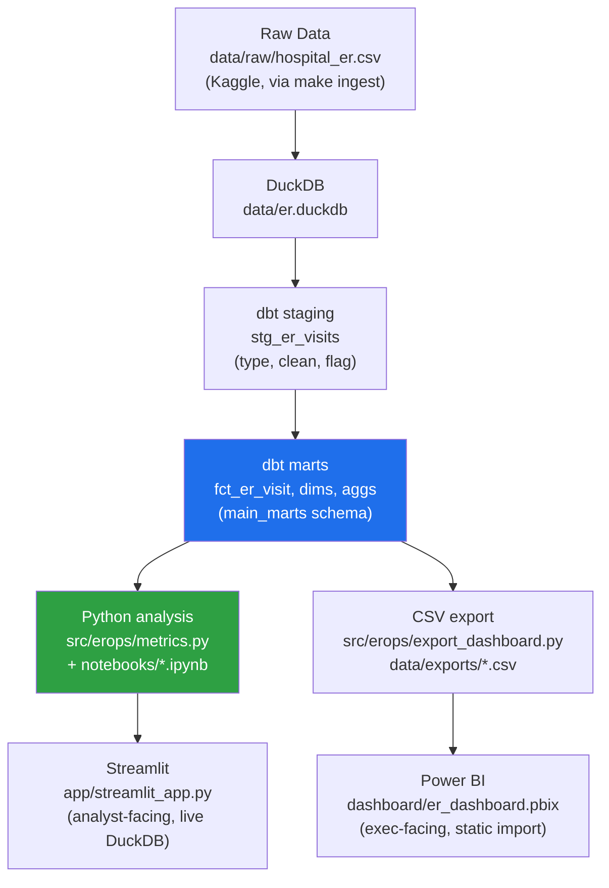

# Architecture

## Pipeline

## Why two BI surfaces

Streamlit reads the live warehouse and is built for an analyst iterating on a question. Power BI reads
a flat CSV export and is built for an executive who needs a report that opens without a Python
environment, a DuckDB driver, or a running dbt project. Both surfaces are downstream of the *same*
marts — `agg_daily_ops`, `agg_segment_waits`, and friends — so a number cannot disagree between them by
construction, only by staleness (the CSV export needs a manual `make export` re-run after a warehouse
rebuild; see `docs/validation.md`).

## Layer responsibilities

| Layer | Owns | Does not own |
|---|---|---|
| **Raw CSV** | Exactly what the source shipped, untouched. | Any typing, cleaning, or business logic. |
| **DuckDB warehouse** | Storage and query engine for every layer above it. | Business rules. |
| **dbt staging** (`stg_er_visits`) | Typing, parsing, flagging (`wait_implausible_flag`), banding (`age_band`), key generation (`segment_key`). | Aggregation or KPI definitions. |
| **dbt marts** (`fct_er_visit`, `dim_*`, `agg_*`) | Every KPI definition and pre-computed statistic (SPC limits, segment CIs) per `docs/measure_spec.md`. | Presentation/formatting. |
| **`src/erops/metrics.py`** | The one set of query functions every Python consumer (notebooks, Streamlit) calls — no ad hoc SQL anywhere downstream of dbt. | Redefining a metric dbt already computed. |
| **Notebooks** | Narrative analysis: business question, methodology, interpretation, recommendation. | New metric definitions. |
| **Streamlit** | Interactive, always-live view for an analyst with the environment set up. | Executive-facing polish (that's Power BI's job). |
| **Power BI** | Formatting, layout, and executive-facing polish over a static export. | Any business logic (`README.md`: "Power BI holds formatting and layout, nothing else"). |

## Why dbt is the single source of truth

Every number in this project — mean/median/percentile, SPC control limit, confidence interval — is
computed exactly once, in a dbt model, in SQL. Python never recomputes a statistic dbt already
produced; it reads `agg_daily_ops.wait_ucl`, it does not re-derive an upper control limit from raw
visits. This is what makes the cross-artifact reconciliation in `docs/validation.md` possible at all —
there is only one formula per metric to get right.
